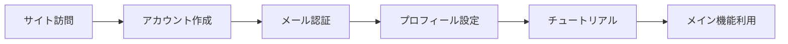

# ユーザーストーリー

ユーザーストーリーは、ユーザーの視点から見た機能を記述します。「誰が」「何を」「なぜ」という3つの要素で構成されます。

## ユーザーストーリーのフォーマット

```
As a [ユーザータイプ],
I want to [実現したいこと],
So that [理由・目的].
```

日本語版:
```
[ユーザータイプ]として、
[実現したいこと]したい。
なぜなら、[理由・目的]だからだ。
```

---

## エピック（大きな機能グループ）

### エピック1: [エピック名: 例) ユーザー管理]

**概要**: [エピックの概要説明]

**ビジネス価値**: [このエピックが提供する価値]

**関連ストーリー**: US-001 〜 US-005

---

## ユーザーストーリー

### US-001: [ストーリー名: 例) ユーザー登録]

**エピック**: [関連するエピック名]

**ストーリー**:
```
[ユーザータイプ: 例) 新規ユーザー]として、
[実現したいこと: 例) メールアドレスとパスワードでアカウントを作成]したい。
なぜなら、[理由: 例) サービスを利用するため]だからだ。
```

**優先度**: [高/中/低] または [Must/Should/Could/Won't]

**ストーリーポイント**: [1/2/3/5/8/13] (フィボナッチ数列を使用)

**受け入れ条件**:
- [ ] メールアドレスとパスワードの入力フォームが表示される
- [ ] メールアドレスの形式が正しいことを検証する
- [ ] パスワードは8文字以上で、英大小文字、数字、記号を含む
- [ ] 登録完了後、確認メールが送信される
- [ ] 確認メール内のリンクをクリックするとアカウントが有効化される

**技術的考慮事項**:
- パスワードはハッシュ化して保存
- メール送信にはSMTPサーバーを使用
- トークンの有効期限は24時間

**UI/UXの考慮事項**:
- 入力エラーはリアルタイムで表示
- パスワード強度のインジケーターを表示
- 既存アカウントがある場合はログイン画面へ誘導

**依存関係**:
- なし（初期機能）

**関連ストーリー**:
- US-002: ログイン
- US-003: パスワードリセット

---

### US-002: [ストーリー名]

**エピック**: [関連するエピック名]

**ストーリー**:
```
[ユーザータイプ]として、
[実現したいこと]したい。
なぜなら、[理由]だからだ。
```

**優先度**: [高/中/低]

**ストーリーポイント**: [1/2/3/5/8/13]

**受け入れ条件**:
- [ ] [条件1]
- [ ] [条件2]
- [ ] [条件3]

**技術的考慮事項**:
- [考慮事項1]
- [考慮事項2]

**UI/UXの考慮事項**:
- [考慮事項1]
- [考慮事項2]

**依存関係**:
- [依存するストーリーID]

**関連ストーリー**:
- [関連するストーリーID]

---

### US-003: [ストーリー名]

[上記と同様の形式で記述]

---

## ユーザーストーリーマッピング

ユーザーの行動フローに沿ってストーリーを配置します。

```
[ユーザーアクティビティ1: 例) アカウント作成]
├── US-001: ユーザー登録
├── US-002: メール認証
└── US-003: プロフィール設定

[ユーザーアクティビティ2: 例) ログイン]
├── US-004: ログイン
├── US-005: パスワードリセット
└── US-006: 多要素認証

[ユーザーアクティビティ3: 例) データ管理]
├── US-007: データ作成
├── US-008: データ編集
├── US-009: データ削除
└── US-010: データ検索
```

---

## ストーリー一覧

| ID | エピック | ストーリー名 | 優先度 | SP | 状態 | スプリント | 担当者 |
|----|---------|------------|--------|----|----|----------|--------|
| US-001 | [エピック] | [名前] | [高/中/低] | [数値] | [未着手/進行中/完了] | [Sprint 1] | [担当者] |
| US-002 | [エピック] | [名前] | [高/中/低] | [数値] | [未着手/進行中/完了] | [Sprint 1] | [担当者] |
| US-003 | [エピック] | [名前] | [高/中/低] | [数値] | [未着手/進行中/完了] | [Sprint 2] | [担当者] |

---

## スプリント計画

### Sprint 1 (例: 2週間)

**目標**: [スプリントの目標]

**含まれるストーリー**:
- US-001: [ストーリー名] (SP: 5)
- US-002: [ストーリー名] (SP: 3)
- US-003: [ストーリー名] (SP: 2)

**合計ストーリーポイント**: 10

**デモ予定**: [日付]

---

### Sprint 2 (例: 2週間)

**目標**: [スプリントの目標]

**含まれるストーリー**:
- US-004: [ストーリー名] (SP: 8)
- US-005: [ストーリー名] (SP: 5)

**合計ストーリーポイント**: 13

**デモ予定**: [日付]

---

## バックログの優先順位付け

優先順位は以下の基準で決定します：

1. **ビジネス価値**: ユーザーや事業への影響度
2. **リスク**: 技術的な不確実性や依存関係
3. **学習**: 新しい知識やフィードバックの獲得
4. **工数**: 実装に必要な時間と労力

### MoSCoW分析

#### Must Have（必須）
- US-001: [ストーリー名]
- US-002: [ストーリー名]

#### Should Have（重要）
- US-003: [ストーリー名]
- US-004: [ストーリー名]

#### Could Have（あれば良い）
- US-005: [ストーリー名]
- US-006: [ストーリー名]

#### Won't Have（今回は対象外）
- US-007: [ストーリー名]
- US-008: [ストーリー名]

---

## ユーザージャーニー

### ジャーニー1: [ジャーニー名: 例) 初回利用]



**関連ストーリー**: US-001, US-002, US-003

**タッチポイント**:
1. ランディングページ（US-001）
2. 登録フォーム（US-001）
3. 確認メール（US-002）
4. プロフィール画面（US-003）
5. チュートリアル（US-004）

**ペインポイント**:
- [痛点1とその対策]
- [痛点2とその対策]

---

### ジャーニー2: [ジャーニー名]

[上記と同様の形式で記述]

---

## 非機能要件に関連するストーリー

### US-NF-001: パフォーマンス向上

**ストーリー**:
```
開発者として、
ページの読み込み時間を2秒以内に短縮したい。
なぜなら、ユーザー体験を向上させるためだ。
```

**受け入れ条件**:
- [ ] 主要ページの読み込み時間が2秒以内
- [ ] Lighthouse スコアが90以上
- [ ] Core Web Vitals の基準をクリア

---

### US-NF-002: セキュリティ強化

**ストーリー**:
```
システム管理者として、
SQLインジェクションやXSS攻撃からシステムを保護したい。
なぜなら、ユーザーデータを安全に保つためだ。
```

**受け入れ条件**:
- [ ] すべての入力値に対してバリデーションを実施
- [ ] OWASPの脆弱性チェックをクリア
- [ ] セキュリティテストを通過

---

## テストシナリオ

各ユーザーストーリーに対するテストシナリオを記述します。

### US-001のテストシナリオ

#### 正常系
1. 有効なメールアドレスとパスワードで登録 → 成功
2. 確認メールのリンクをクリック → アカウント有効化成功

#### 異常系
1. 無効なメールアドレス形式で登録 → エラーメッセージ表示
2. パスワードが条件を満たさない → エラーメッセージ表示
3. 既に登録済みのメールアドレスで登録 → 重複エラー表示

#### 境界値
1. パスワード7文字（最小値-1） → エラー
2. パスワード8文字（最小値） → 成功
3. メールアドレス254文字（最大値） → 成功
4. メールアドレス255文字（最大値+1） → エラー

---

## レトロスペクティブ（振り返り）

各スプリント終了後に記録します。

### Sprint 1 振り返り

**よかったこと**:
- [項目1]
- [項目2]

**改善が必要なこと**:
- [項目1]
- [項目2]

**次回のアクション**:
- [ ] [アクション1]
- [ ] [アクション2]

---

## 用語集（ユーザーストーリー関連）

| 用語 | 定義 |
|-----|------|
| エピック | 複数のユーザーストーリーをまとめた大きな機能単位 |
| ストーリーポイント | ストーリーの相対的な複雑さや工数を表す数値 |
| 受け入れ条件 | ストーリーが完了したと判断するための基準 |
| スプリント | 開発の反復単位（通常1-4週間） |
| バックログ | 未実装のストーリーのリスト |
| ベロシティ | チームが1スプリントで完了できるストーリーポイントの平均 |
