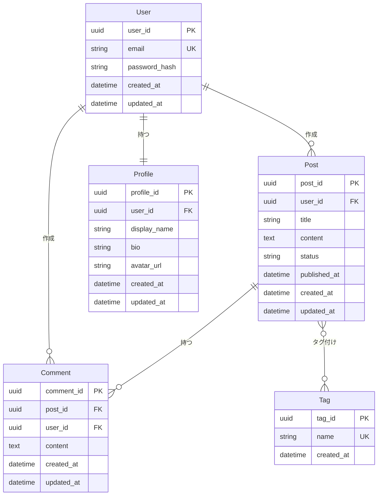
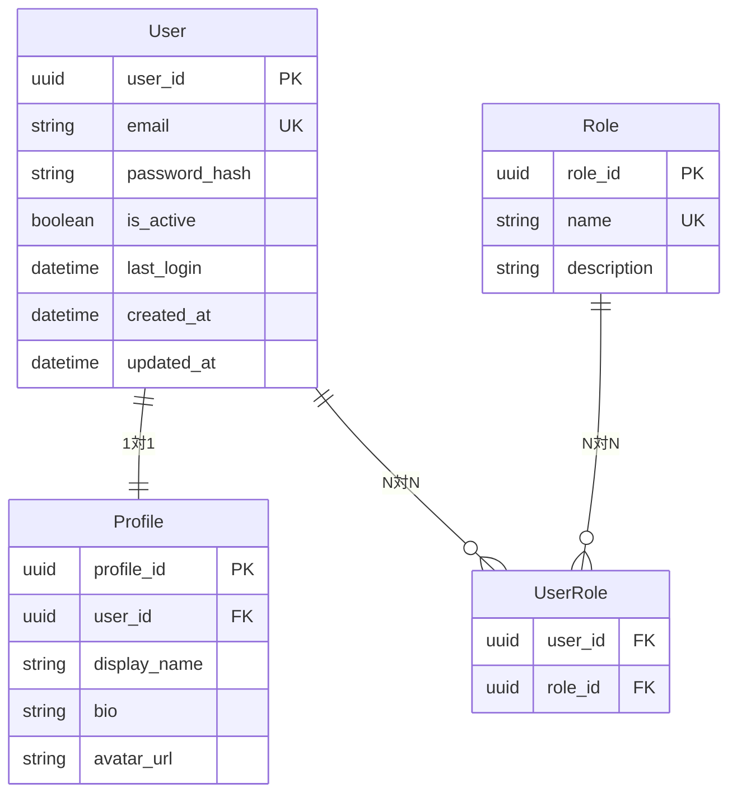
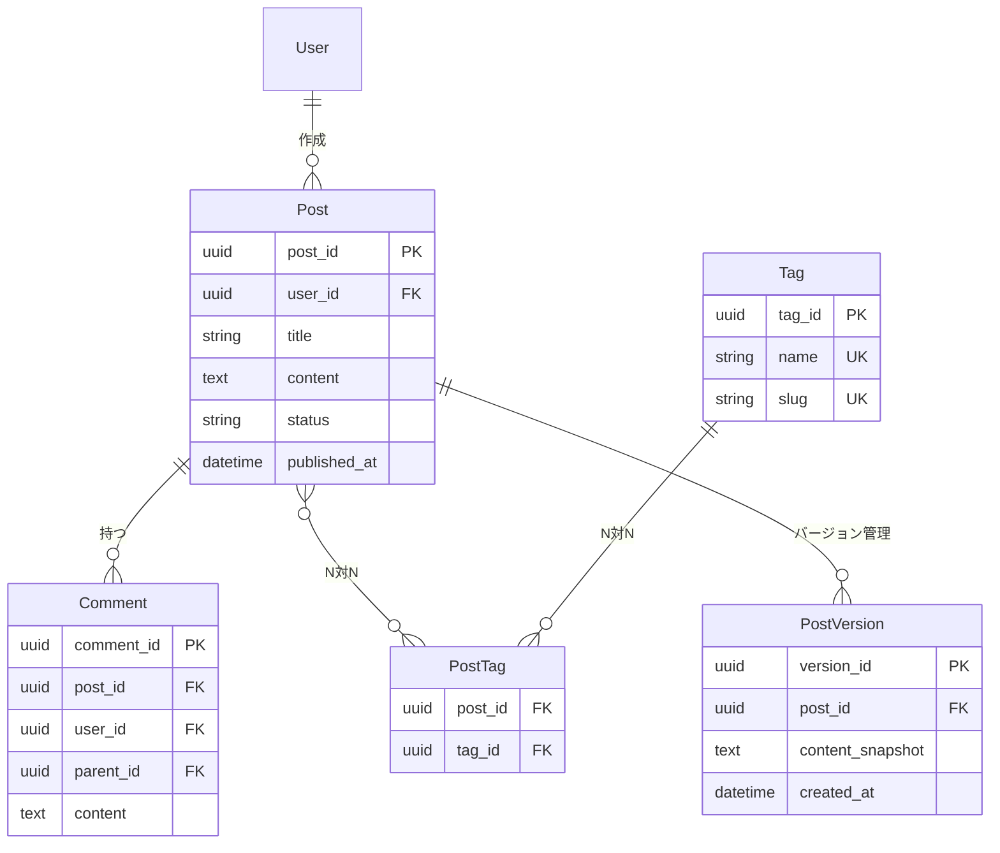

# エンティティ関連図 (ER図)

データモデルのエンティティとその関係を定義します。

## 概要

このドキュメントでは、システムで扱うデータのエンティティ（実体）とそれらの関係を明確にします。

---

## エンティティ一覧

| エンティティ名 | 説明 | 主キー | 備考 |
|--------------|------|--------|------|
| [例: User] | [ユーザー情報] | [user_id] | [認証情報を含む] |
| [例: Profile] | [ユーザープロフィール] | [profile_id] | [Userと1:1関係] |
| [例: Post] | [投稿情報] | [post_id] | [Userと1:N関係] |
| [エンティティ名] | [説明] | [主キー] | [備考] |

---

## ER図

### 全体ER図

### 部分ER図（モジュール別）

#### ユーザー管理モジュール

#### コンテンツ管理モジュール

---

## エンティティ詳細

### User（ユーザー）

**説明**: システムのユーザー情報を管理

**属性**:

| 属性名 | データ型 | 制約 | 説明 |
|-------|---------|------|------|
| user_id | UUID | PK, NOT NULL | ユーザーID |
| email | VARCHAR(255) | UK, NOT NULL | メールアドレス |
| password_hash | VARCHAR(255) | NOT NULL | パスワードハッシュ |
| is_active | BOOLEAN | DEFAULT TRUE | アカウント有効フラグ |
| is_verified | BOOLEAN | DEFAULT FALSE | メール認証済みフラグ |
| last_login | TIMESTAMP | NULL | 最終ログイン日時 |
| created_at | TIMESTAMP | NOT NULL | 作成日時 |
| updated_at | TIMESTAMP | NOT NULL | 更新日時 |

**関連**:
- Profile (1:1)
- Post (1:N) - 作成者として
- Comment (1:N) - 作成者として
- UserRole (N:N)

**ビジネスルール**:
- メールアドレスは一意である必要がある
- パスワードは8文字以上で、ハッシュ化して保存
- is_active が FALSE の場合、ログイン不可

---

### Profile（プロフィール）

**説明**: ユーザーの公開プロフィール情報

**属性**:

| 属性名 | データ型 | 制約 | 説明 |
|-------|---------|------|------|
| profile_id | UUID | PK, NOT NULL | プロフィールID |
| user_id | UUID | FK, UK, NOT NULL | ユーザーID |
| display_name | VARCHAR(100) | NOT NULL | 表示名 |
| bio | TEXT | NULL | 自己紹介 |
| avatar_url | VARCHAR(500) | NULL | アバター画像URL |
| location | VARCHAR(100) | NULL | 居住地 |
| website | VARCHAR(255) | NULL | Webサイト |
| created_at | TIMESTAMP | NOT NULL | 作成日時 |
| updated_at | TIMESTAMP | NOT NULL | 更新日時 |

**関連**:
- User (1:1)

**ビジネスルール**:
- 1ユーザーにつき1プロフィール
- display_name は必須
- bio は最大500文字

---

### Post（投稿）

**説明**: ユーザーが作成するコンテンツ

**属性**:

| 属性名 | データ型 | 制約 | 説明 |
|-------|---------|------|------|
| post_id | UUID | PK, NOT NULL | 投稿ID |
| user_id | UUID | FK, NOT NULL | 作成者ID |
| title | VARCHAR(255) | NOT NULL | タイトル |
| content | TEXT | NOT NULL | 本文 |
| status | VARCHAR(20) | NOT NULL | ステータス (draft/published/archived) |
| published_at | TIMESTAMP | NULL | 公開日時 |
| view_count | INTEGER | DEFAULT 0 | 閲覧数 |
| created_at | TIMESTAMP | NOT NULL | 作成日時 |
| updated_at | TIMESTAMP | NOT NULL | 更新日時 |

**関連**:
- User (N:1) - 作成者として
- Comment (1:N) - コメントを持つ
- Tag (N:N) - PostTag経由
- PostVersion (1:N) - バージョン履歴

**ビジネスルール**:
- status が published の場合のみ公開される
- published_at は status が published の場合に必須
- タイトルは255文字以内

---

### Comment（コメント）

**説明**: 投稿に対するコメント

**属性**:

| 属性名 | データ型 | 制約 | 説明 |
|-------|---------|------|------|
| comment_id | UUID | PK, NOT NULL | コメントID |
| post_id | UUID | FK, NOT NULL | 投稿ID |
| user_id | UUID | FK, NOT NULL | 作成者ID |
| parent_id | UUID | FK, NULL | 親コメントID（ネスト用） |
| content | TEXT | NOT NULL | コメント本文 |
| is_deleted | BOOLEAN | DEFAULT FALSE | 削除フラグ |
| created_at | TIMESTAMP | NOT NULL | 作成日時 |
| updated_at | TIMESTAMP | NOT NULL | 更新日時 |

**関連**:
- Post (N:1) - 投稿に属する
- User (N:1) - 作成者として
- Comment (自己参照) - ネストコメント用

**ビジネスルール**:
- parent_id が NULL の場合、トップレベルコメント
- parent_id が存在する場合、返信コメント
- is_deleted が TRUE の場合、内容を非表示

---

### Tag（タグ）

**説明**: 投稿の分類用タグ

**属性**:

| 属性名 | データ型 | 制約 | 説明 |
|-------|---------|------|------|
| tag_id | UUID | PK, NOT NULL | タグID |
| name | VARCHAR(50) | UK, NOT NULL | タグ名 |
| slug | VARCHAR(50) | UK, NOT NULL | URL用スラッグ |
| description | TEXT | NULL | タグの説明 |
| usage_count | INTEGER | DEFAULT 0 | 使用回数 |
| created_at | TIMESTAMP | NOT NULL | 作成日時 |

**関連**:
- Post (N:N) - PostTag経由

**ビジネスルール**:
- タグ名とスラッグは一意
- タグ名は大文字小文字を区別しない
- 使用されていないタグは定期的に削除

---

## リレーションシップ詳細

### User - Profile (1:1)

- **カーディナリティ**: 1対1
- **必須性**: 必須（Userが作成されたら自動的にProfileも作成）
- **削除ルール**: CASCADE（Userが削除されたらProfileも削除）

### User - Post (1:N)

- **カーディナリティ**: 1対多
- **必須性**: Postには必ずUserが必要
- **削除ルール**: 
  - SET NULL（論理削除の場合）
  - CASCADE（物理削除の場合）

### Post - Comment (1:N)

- **カーディナリティ**: 1対多
- **必須性**: CommentにはPostが必要
- **削除ルール**: CASCADE（Postが削除されたらCommentも削除）

### Post - Tag (N:N)

- **カーディナリティ**: 多対多
- **中間テーブル**: PostTag
- **必須性**: 任意（Postはタグなしでも存在可能）
- **削除ルール**: 中間テーブルのレコードのみ削除

### Comment - Comment (自己参照)

- **カーディナリティ**: 1対多（親子関係）
- **必須性**: 任意（parent_idがNULLの場合はトップレベル）
- **削除ルール**: CASCADE（親コメントが削除されたら子も削除）

---

## 正規化とデータ整合性

### 正規化レベル

このデータモデルは **第3正規形（3NF）** を満たしています：

1. **第1正規形**: すべての属性が原子値
2. **第2正規形**: 部分関数従属性を排除
3. **第3正規形**: 推移的関数従属性を排除

### 非正規化の検討事項

パフォーマンス最適化のため、以下の非正規化を検討：

| テーブル | 非正規化項目 | 理由 | トレードオフ |
|---------|------------|------|------------|
| Post | view_count | 頻繁に更新されるカウンター | 更新の整合性管理が必要 |
| Tag | usage_count | 表示時の並び替えに使用 | 定期的な再計算が必要 |
| User | post_count | プロフィール表示の高速化 | 更新トリガーが必要 |

---

## インデックス戦略

### 推奨インデックス

| テーブル | カラム | インデックスタイプ | 理由 |
|---------|-------|-----------------|------|
| User | email | UNIQUE | ログイン検索 |
| User | created_at | B-tree | 新規ユーザー一覧 |
| Post | user_id | B-tree | ユーザーの投稿一覧 |
| Post | status, published_at | Composite | 公開投稿の検索 |
| Comment | post_id | B-tree | 投稿のコメント一覧 |
| Comment | user_id | B-tree | ユーザーのコメント一覧 |
| Tag | slug | UNIQUE | URL検索 |
| PostTag | post_id, tag_id | Composite | 多対多関連検索 |

---

## データライフサイクル

### データ保持ポリシー

| エンティティ | 保持期間 | アーカイブ | 削除ルール |
|------------|---------|----------|----------|
| User | 無期限 | - | ユーザー自身が削除可能 |
| Post (draft) | 最終更新から1年 | → archived | 自動アーカイブ |
| Post (published) | 無期限 | - | 作成者が削除可能 |
| Comment | 無期限 | - | 論理削除（is_deleted = TRUE） |
| Log | 90日 | → S3 | 自動削除 |

---

## 拡張性の考慮

### 将来の拡張候補

1. **マルチメディア対応**
   - Media エンティティの追加
   - Post - Media の多対多関係

2. **通知機能**
   - Notification エンティティ
   - User - Notification の1対多関係

3. **いいね機能**
   - Like エンティティ
   - User - Post の多対多関係（Like経由）

4. **フォロー機能**
   - Follow エンティティ
   - User - User の多対多関係（Follow経由）

---

## 更新履歴

| 日付 | 変更内容 | 理由 | 担当者 |
|-----|---------|------|--------|
| [YYYY-MM-DD] | [変更内容] | [理由] | [担当者] |
