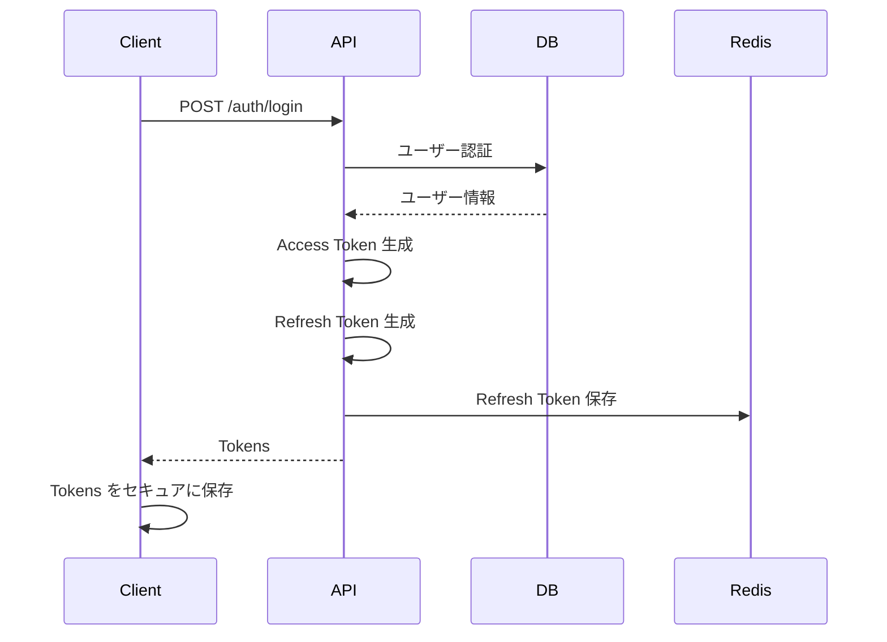
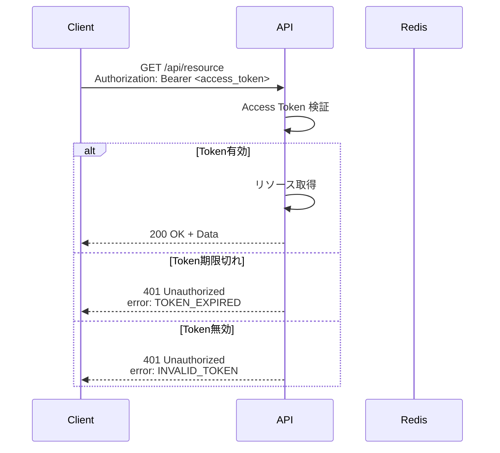
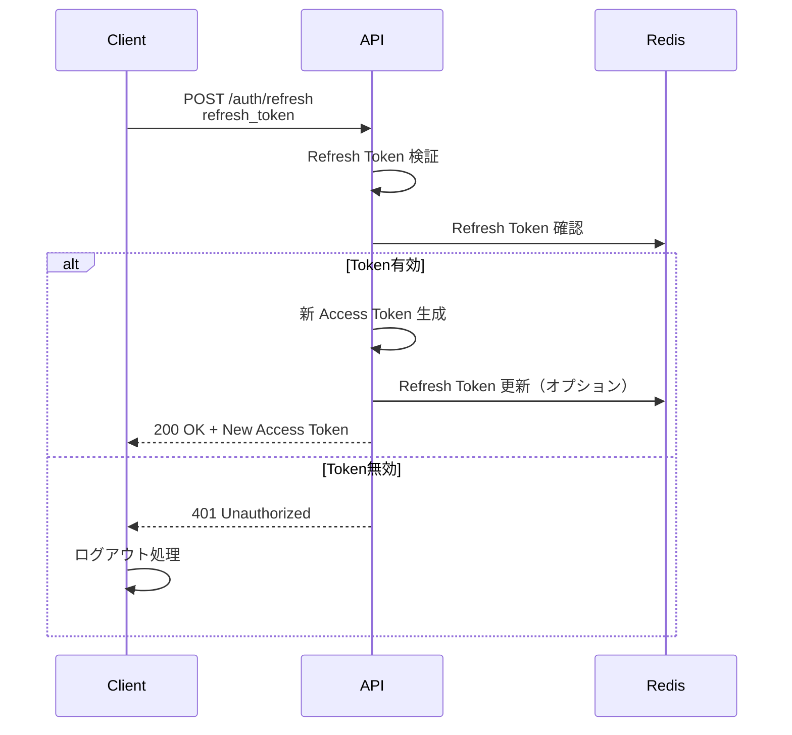
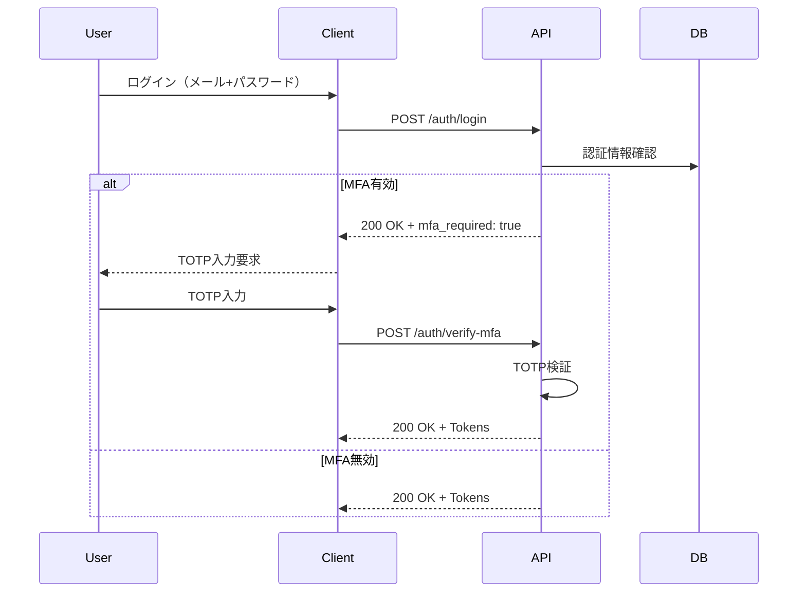
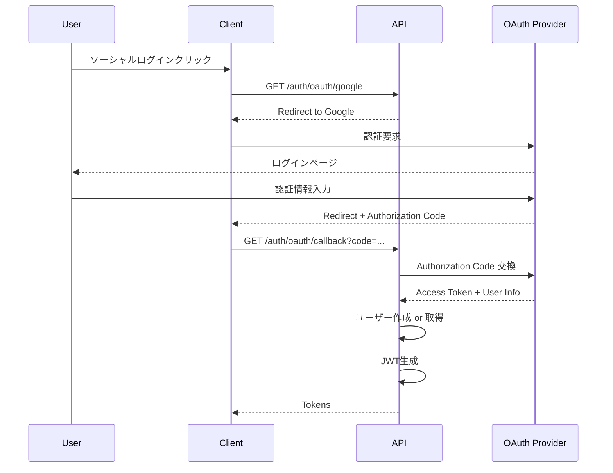

# API認証・認可

APIの認証と認可の仕組みを定義します。

## 概要

このドキュメントでは、API利用時の認証方式、トークン管理、権限制御、セキュリティベストプラクティスを明確にします。

---

## 認証方式

### JWT (JSON Web Token) ベース認証

**選定理由**:
- ステートレスで水平スケーリングに対応
- トークンに必要な情報を含められる
- 広く採用されている標準仕様

**トークンの種類**:
1. **Access Token**: API呼び出しに使用（短命）
2. **Refresh Token**: Access Token の更新に使用（長命）

---

## JWT 構造

### Access Token

```json
{
  "header": {
    "alg": "HS256",
    "typ": "JWT"
  },
  "payload": {
    "user_id": "550e8400-e29b-41d4-a716-446655440000",
    "email": "user@example.com",
    "roles": ["user"],
    "iat": 1640995200,
    "exp": 1640998800
  },
  "signature": "..."
}
```

**ペイロード説明**:
- `user_id`: ユーザーID
- `email`: メールアドレス
- `roles`: ロール配列（user, admin, moderator等）
- `iat` (Issued At): 発行日時（UNIXタイムスタンプ）
- `exp` (Expiration): 有効期限（UNIXタイムスタンプ）

### Refresh Token

```json
{
  "header": {
    "alg": "HS256",
    "typ": "JWT"
  },
  "payload": {
    "user_id": "550e8400-e29b-41d4-a716-446655440000",
    "token_id": "refresh-token-unique-id",
    "iat": 1640995200,
    "exp": 1643587200
  },
  "signature": "..."
}
```

**特徴**:
- Access Token より有効期限が長い（30日）
- `token_id` で無効化管理が可能

---

## トークンライフサイクル

### 1. 認証フロー



### 2. API呼び出しフロー



### 3. トークンリフレッシュフロー



---

## トークン管理

### トークン有効期限

| トークンタイプ | 有効期限 | 保存場所 |
|--------------|---------|---------|
| Access Token | 1時間 | メモリ（変数）/ localStorage（注意が必要） |
| Refresh Token | 30日 | httpOnly Cookie（推奨）/ secure storage |

### トークン保存のベストプラクティス

#### ✅ 推奨: httpOnly Cookie

```javascript
// バックエンド（レスポンス設定）
res.cookie('refresh_token', refreshToken, {
  httpOnly: true,  // JavaScriptからアクセス不可
  secure: true,    // HTTPS のみ
  sameSite: 'strict',  // CSRF 対策
  maxAge: 30 * 24 * 60 * 60 * 1000  // 30日
});
```

#### ⚠️ 注意が必要: localStorage

```javascript
// XSS 攻撃のリスクがあるため、Access Token のみに限定
localStorage.setItem('access_token', accessToken);
```

#### ✅ 推奨: メモリ変数

```javascript
// React での実装例
let accessToken = null;

export const setAccessToken = (token) => {
  accessToken = token;
};

export const getAccessToken = () => {
  return accessToken;
};
```

### トークン更新戦略

#### 自動更新（Silent Refresh）

```javascript
// Access Token 期限切れ前に自動更新
setInterval(async () => {
  if (shouldRefreshToken()) {
    const newToken = await refreshAccessToken();
    setAccessToken(newToken);
  }
}, 50 * 60 * 1000); // 50分ごと（1時間の有効期限に対して）
```

#### インターセプターでの更新

```javascript
// Axios インターセプター例
axios.interceptors.response.use(
  (response) => response,
  async (error) => {
    if (error.response?.status === 401 && error.response?.data?.error?.code === 'TOKEN_EXPIRED') {
      const newToken = await refreshAccessToken();
      setAccessToken(newToken);
      // 元のリクエストを再試行
      error.config.headers['Authorization'] = `Bearer ${newToken}`;
      return axios.request(error.config);
    }
    return Promise.reject(error);
  }
);
```

---

## 認可（Authorization）

### ロールベースアクセス制御（RBAC）

#### ロール定義

| ロール | 説明 | 権限 |
|-------|------|------|
| **user** | 一般ユーザー | 自分のリソースの作成・読取・更新・削除 |
| **moderator** | モデレーター | すべてのコンテンツの読取・編集・削除 |
| **admin** | 管理者 | すべての操作が可能 |

#### 権限マトリクス

| リソース/操作 | user | moderator | admin |
|-------------|------|-----------|-------|
| 自分の投稿 作成 | ✅ | ✅ | ✅ |
| 自分の投稿 更新 | ✅ | ✅ | ✅ |
| 自分の投稿 削除 | ✅ | ✅ | ✅ |
| 他人の投稿 読取 | ✅ | ✅ | ✅ |
| 他人の投稿 更新 | ❌ | ✅ | ✅ |
| 他人の投稿 削除 | ❌ | ✅ | ✅ |
| ユーザー管理 | ❌ | ❌ | ✅ |

### リソースベースアクセス制御

```python
# 例: 投稿の所有者チェック
def check_post_ownership(user_id: UUID, post_id: UUID) -> bool:
    post = get_post(post_id)
    return post.user_id == user_id

# デコレーターでの実装
@require_auth
@require_ownership('post')
def update_post(post_id: UUID, data: PostUpdate):
    # 更新処理
    pass
```

---

## セキュリティベストプラクティス

### 1. トークンシークレットの管理

```python
# 環境変数から読み込む
import os

JWT_SECRET = os.getenv('JWT_SECRET_KEY')
JWT_ALGORITHM = 'HS256'

# シークレットは長く複雑にする（最低32文字）
# 例: openssl rand -hex 32
```

### 2. トークン検証

```python
def verify_access_token(token: str) -> dict:
    try:
        payload = jwt.decode(
            token,
            JWT_SECRET,
            algorithms=[JWT_ALGORITHM]
        )
        return payload
    except jwt.ExpiredSignatureError:
        raise TokenExpiredError()
    except jwt.InvalidTokenError:
        raise InvalidTokenError()
```

### 3. トークンブラックリスト

```python
# Redis を使用したブラックリスト管理
def logout(token: str, user_id: UUID):
    # トークンをブラックリストに追加
    redis_client.setex(
        f"blacklist:{token}",
        3600,  # Access Token の有効期限と同じ
        "revoked"
    )

def is_token_blacklisted(token: str) -> bool:
    return redis_client.exists(f"blacklist:{token}") > 0
```

### 4. レート制限

```python
# 認証エンドポイントのレート制限
from slowapi import Limiter
from slowapi.util import get_remote_address

limiter = Limiter(key_func=get_remote_address)

@app.post("/auth/login")
@limiter.limit("5/15minute")  # 15分間に5回まで
async def login(credentials: LoginCredentials):
    # ログイン処理
    pass
```

---

## パスワードセキュリティ

### パスワードハッシュ化

```python
from passlib.context import CryptContext

pwd_context = CryptContext(schemes=["bcrypt"], deprecated="auto")

def hash_password(password: str) -> str:
    return pwd_context.hash(password)

def verify_password(plain_password: str, hashed_password: str) -> bool:
    return pwd_context.verify(plain_password, hashed_password)
```

### パスワードポリシー

- **最小長**: 8文字
- **複雑性**: 英大文字、小文字、数字、記号を各1文字以上含む
- **履歴管理**: 過去5世代のパスワードは再利用不可
- **有効期限**: 90日（オプション）
- **ロックアウト**: 5回連続失敗で15分間ロック

```python
import re

def validate_password(password: str) -> bool:
    if len(password) < 8:
        return False
    
    # 英大文字、小文字、数字、記号を含むかチェック
    patterns = [
        r'[A-Z]',  # 大文字
        r'[a-z]',  # 小文字
        r'[0-9]',  # 数字
        r'[!@#$%^&*(),.?":{}|<>]'  # 記号
    ]
    
    return all(re.search(pattern, password) for pattern in patterns)
```

---

## 多要素認証（MFA）

### TOTP (Time-based One-Time Password)



### MFA設定フロー

```python
import pyotp

# MFA設定
def setup_mfa(user_id: UUID) -> dict:
    secret = pyotp.random_base32()
    
    # QRコード生成用のURL
    totp_uri = pyotp.totp.TOTP(secret).provisioning_uri(
        name=user.email,
        issuer_name="YourApp"
    )
    
    # シークレットを暗号化して保存
    save_mfa_secret(user_id, encrypt(secret))
    
    return {
        "secret": secret,
        "qr_code_url": totp_uri
    }

# TOTP検証
def verify_totp(user_id: UUID, token: str) -> bool:
    secret = decrypt(get_mfa_secret(user_id))
    totp = pyotp.TOTP(secret)
    return totp.verify(token, valid_window=1)  # ±30秒の誤差を許容
```

---

## OAuth 2.0 / OpenID Connect（オプション）

### ソーシャルログイン



### 対応プロバイダー

| プロバイダー | スコープ | 取得情報 |
|------------|---------|---------|
| Google | openid, email, profile | email, name, picture |
| GitHub | user:email | email, name, avatar_url |
| Facebook | email, public_profile | email, name, picture |

---

## API キー認証（サードパーティ統合用）

### API キーの発行

```python
import secrets

def generate_api_key() -> str:
    return f"sk_{secrets.token_urlsafe(32)}"

# 例: sk_abc123def456...
```

### API キー認証

```python
from fastapi import Header, HTTPException

async def verify_api_key(x_api_key: str = Header(...)):
    api_key = get_api_key_from_db(x_api_key)
    
    if not api_key or not api_key.is_active:
        raise HTTPException(status_code=401, detail="Invalid API key")
    
    # レート制限チェック
    if is_rate_limited(api_key.key):
        raise HTTPException(status_code=429, detail="Rate limit exceeded")
    
    return api_key
```

**使用例**:
```bash
curl -H "X-API-Key: sk_abc123def456..." https://api.example.com/v1/posts
```

---

## セッション管理

### セッション情報

```python
# Redis にセッション情報を保存
session_data = {
    "user_id": "550e8400-e29b-41d4-a716-446655440000",
    "email": "user@example.com",
    "roles": ["user"],
    "last_activity": datetime.now().isoformat(),
    "ip_address": "192.168.1.1",
    "user_agent": "Mozilla/5.0..."
}

redis_client.setex(
    f"session:{user_id}",
    3600,  # 1時間
    json.dumps(session_data)
)
```

### アクティブセッション管理

```python
# ユーザーのアクティブセッション一覧
def get_active_sessions(user_id: UUID) -> list:
    sessions = redis_client.keys(f"session:{user_id}:*")
    return [json.loads(redis_client.get(s)) for s in sessions]

# 特定セッションの無効化
def revoke_session(user_id: UUID, session_id: str):
    redis_client.delete(f"session:{user_id}:{session_id}")

# 全セッションの無効化（パスワード変更時など）
def revoke_all_sessions(user_id: UUID):
    sessions = redis_client.keys(f"session:{user_id}:*")
    if sessions:
        redis_client.delete(*sessions)
```

---

## 監査ログ

### ログ記録

```python
def log_auth_event(event_type: str, user_id: UUID, details: dict):
    log_entry = {
        "event_type": event_type,
        "user_id": str(user_id),
        "timestamp": datetime.now().isoformat(),
        "ip_address": details.get("ip_address"),
        "user_agent": details.get("user_agent"),
        "status": details.get("status"),
        "details": details
    }
    
    # データベースまたはログサービスに保存
    save_audit_log(log_entry)
```

### 記録すべきイベント

- ログイン成功/失敗
- ログアウト
- パスワード変更
- MFA設定変更
- トークンリフレッシュ
- API キー生成/無効化
- 権限変更

---

## セキュリティチェックリスト

- [ ] JWT シークレットを環境変数で管理
- [ ] HTTPS の使用を強制
- [ ] トークンに適切な有効期限を設定
- [ ] Refresh Token を httpOnly Cookie に保存
- [ ] レート制限を実装
- [ ] パスワードを bcrypt でハッシュ化
- [ ] 認証失敗時のアカウントロック機能
- [ ] CORS を適切に設定
- [ ] CSP (Content Security Policy) ヘッダーを設定
- [ ] セキュリティヘッダー（X-Frame-Options, X-Content-Type-Options等）を設定
- [ ] 監査ログを記録
- [ ] 定期的なセキュリティ監査

---

## トラブルシューティング

### よくある問題

| 問題 | 原因 | 解決策 |
|-----|------|--------|
| Token Expired | Access Token の有効期限切れ | Refresh Token で更新 |
| Invalid Token | トークンの改ざんまたは無効 | 再ログイン |
| CORS Error | CORS 設定の問題 | APIサーバーのCORS設定確認 |
| 401 Unauthorized | 認証情報が正しくない | 認証情報を確認 |
| 403 Forbidden | 権限不足 | ユーザーのロールを確認 |

---

## 更新履歴

| 日付 | 変更内容 | 理由 | 担当者 |
|-----|---------|------|--------|
| [YYYY-MM-DD] | [変更内容] | [理由] | [担当者] |
