# データフロー

システム内のデータの流れを可視化し、説明します。

## 概要

このドキュメントでは、フロントエンドからバックエンド、データベースまでのデータの流れを明確にします。

---

## 全体データフロー

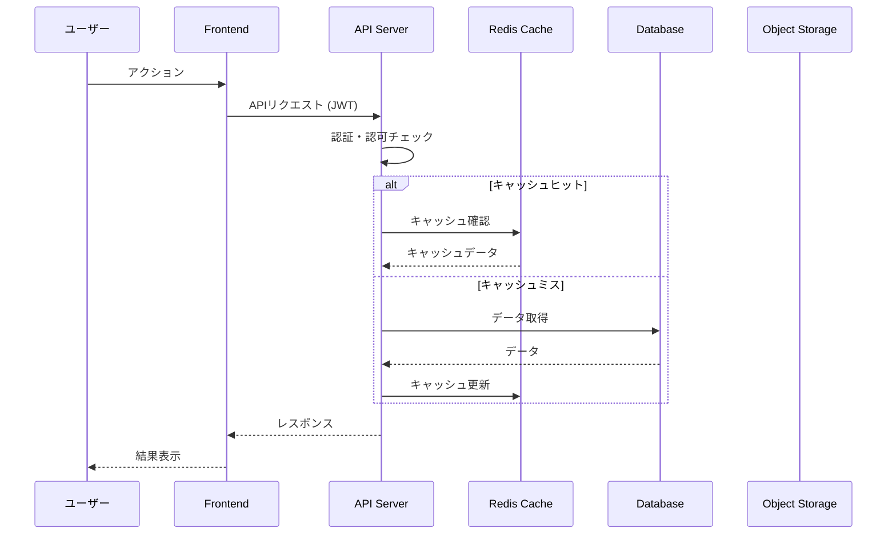

---

## ユースケース別データフロー

### 1. ユーザー登録フロー

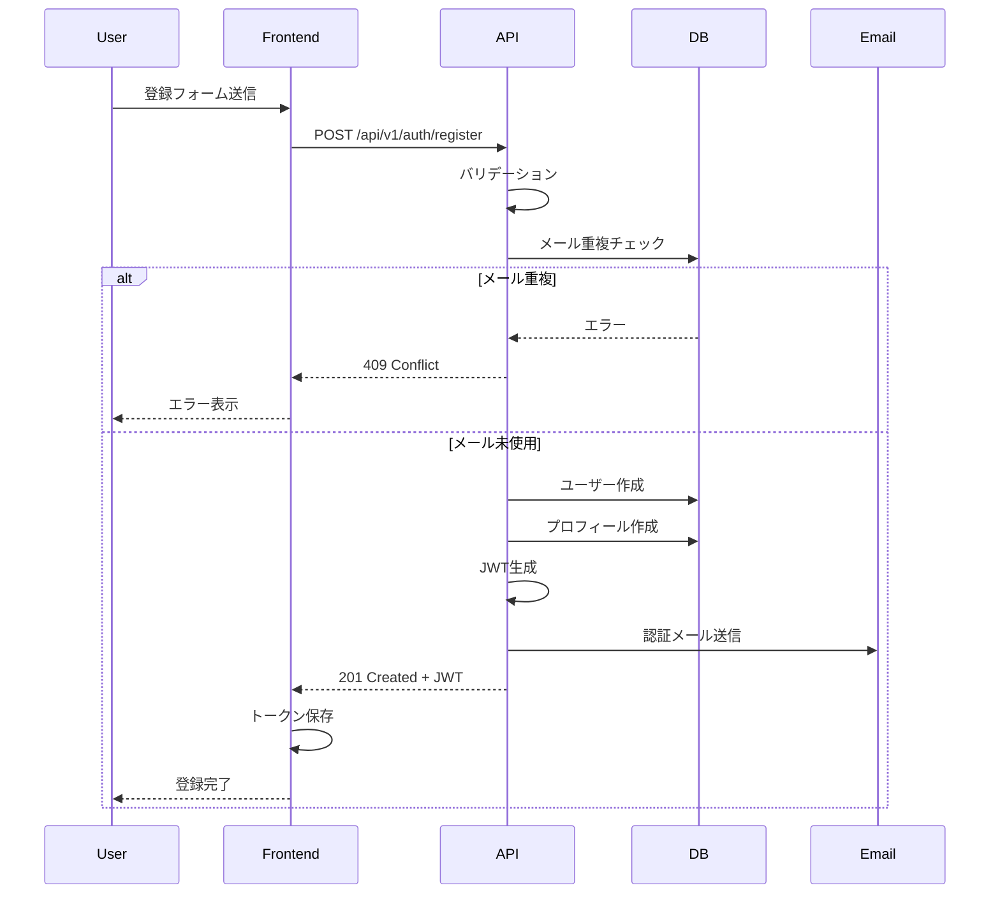

### 2. ログインフロー

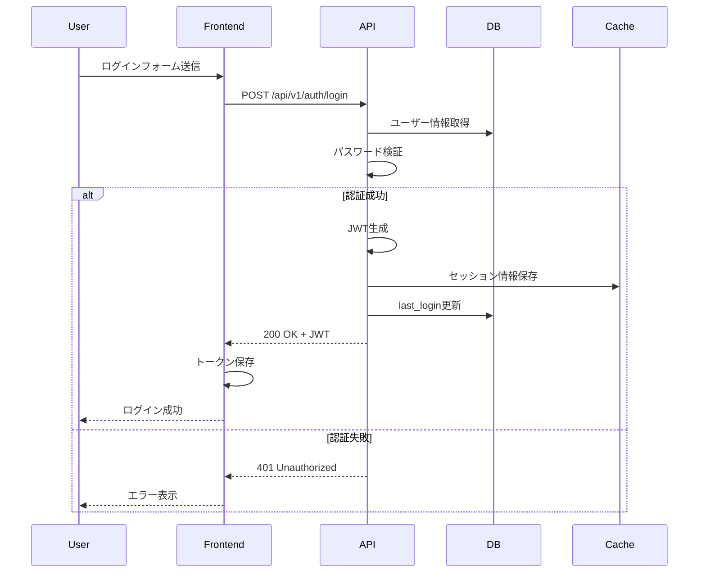

### 3. 投稿作成フロー

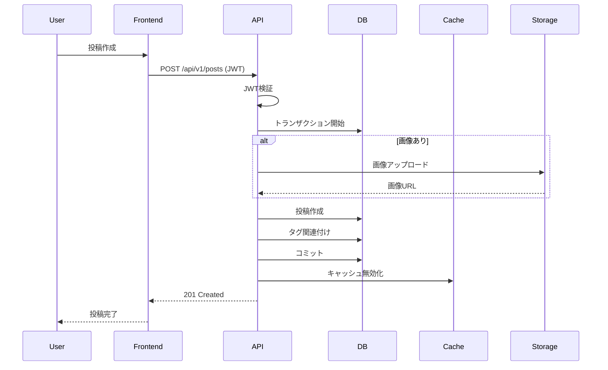

### 4. 投稿一覧取得フロー（キャッシュ活用）

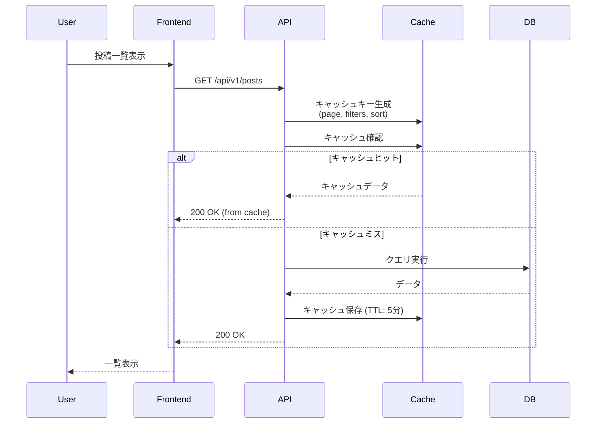

### 5. コメント投稿フロー（リアルタイム通知）

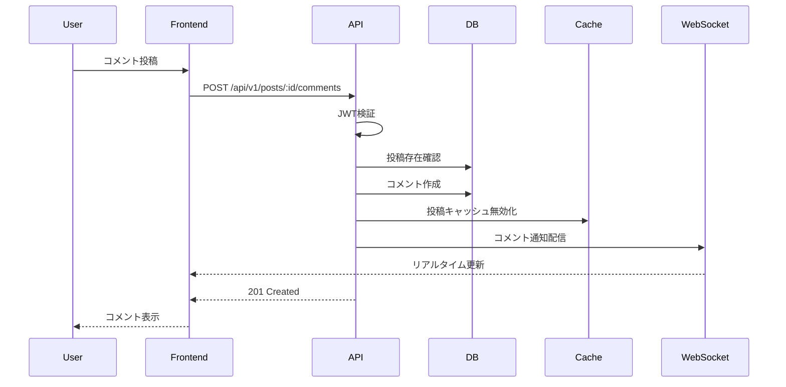

---

## データ永続化フロー

### 書き込み処理

```
[Frontend] 
    ↓ HTTP POST/PUT
[API Server]
    ↓ バリデーション
[Business Logic]
    ↓ データ変換
[Repository Layer]
    ↓ SQL生成
[Database (PostgreSQL)]
    ↓ トリガー実行
[Audit Log / Cache Invalidation]
```

### 読み取り処理

```
[Frontend]
    ↓ HTTP GET
[API Server]
    ↓ 認証・認可
[Cache Layer (Redis)]
    ├─ Cache Hit → [Response]
    └─ Cache Miss
        ↓
    [Database (PostgreSQL)]
        ↓ Read Replica
    [Response + Cache Update]
```

---

## エラーハンドリングフロー

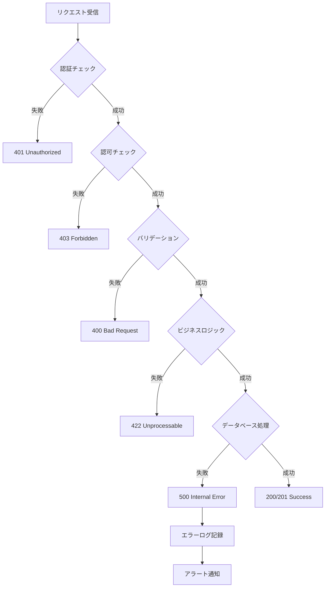

---

## データ同期フロー

### フロントエンド状態管理

```
[Server State]
    ↓ API Call
[React Query / Redux]
    ↓ Cache
[Local State]
    ↓ UI Update
[User Interface]

[Optimistic Update]
    ↓ 即座にUI更新
[Background Sync]
    ↓ APIコール
[Success] → [確定]
[Failure] → [ロールバック]
```

---

## バッチ処理フロー

### 定期実行ジョブ

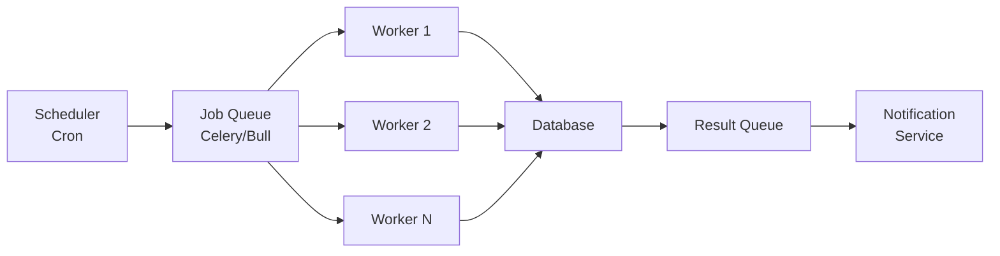

**例: 日次集計ジョブ**

1. 毎日深夜2時にスケジューラーが起動
2. ジョブキューにタスクを追加
3. ワーカーが並列処理
4. 集計結果をデータベースに保存
5. 完了通知を送信

---

## ファイルアップロードフロー

### 直接アップロード（S3 Presigned URL）

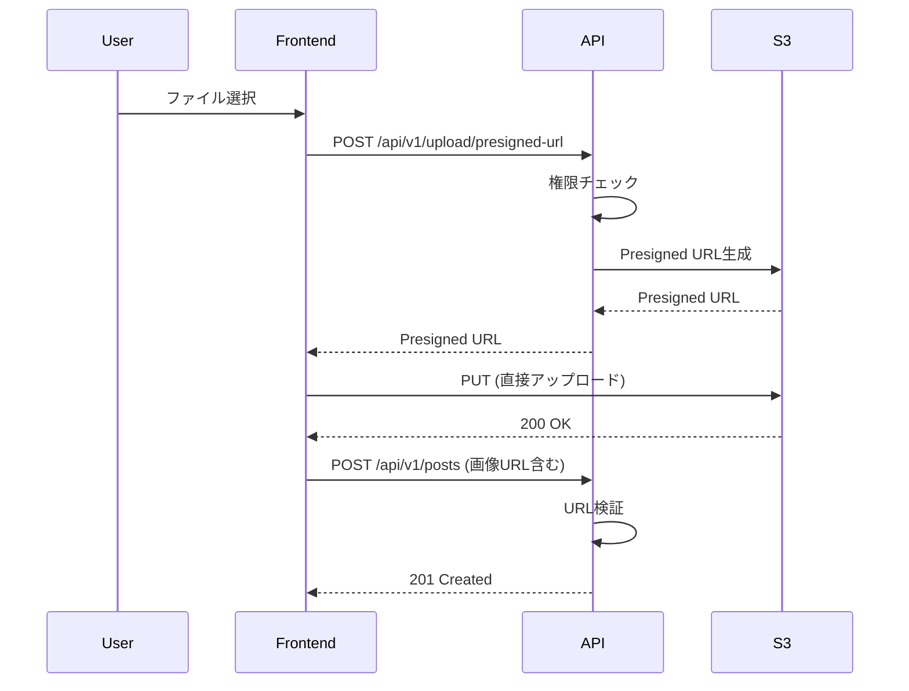

---

## WebSocket通信フロー

### リアルタイム通知

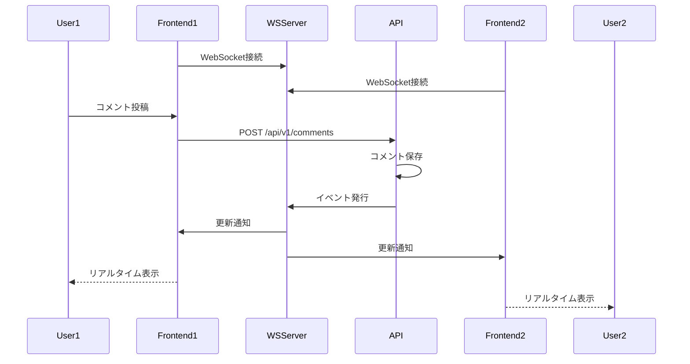

---

## データ変換フロー

### レイヤー別データ形式

```
[Frontend - TypeScript Interface]
interface Post {
  postId: string;
  title: string;
  createdAt: Date;
}

[API - JSON]
{
  "post_id": "uuid",
  "title": "string",
  "created_at": "2024-01-01T00:00:00Z"
}

[Backend - Python Model]
class Post:
    post_id: UUID
    title: str
    created_at: datetime

[Database - SQL]
posts (
  post_id UUID,
  title VARCHAR(255),
  created_at TIMESTAMP
)
```

### 変換タイミング

1. **Frontend → API**: camelCase → snake_case
2. **API → Backend**: JSON → Python Object
3. **Backend → Database**: ORM Model → SQL
4. **Database → Backend**: SQL Result → ORM Model
5. **Backend → API**: Python Object → JSON
6. **API → Frontend**: snake_case → camelCase

---

## セキュリティフロー

### 認証・認可フロー

```
[Request] 
    ↓
[Rate Limiter] (過剰なリクエストをブロック)
    ↓
[JWT Verification] (トークンの有効性確認)
    ↓
[User Context] (ユーザー情報をコンテキストに格納)
    ↓
[Authorization] (リソースへのアクセス権限確認)
    ↓
[Resource Access]
```

### データ暗号化フロー

```
[User Input]
    ↓ HTTPS (TLS 1.3)
[API Server]
    ↓ 機密データ暗号化
[Database]
    ↓ 暗号化ストレージ (AES-256)
[Disk]
```

---

## モニタリングとログ

### ログ収集フロー

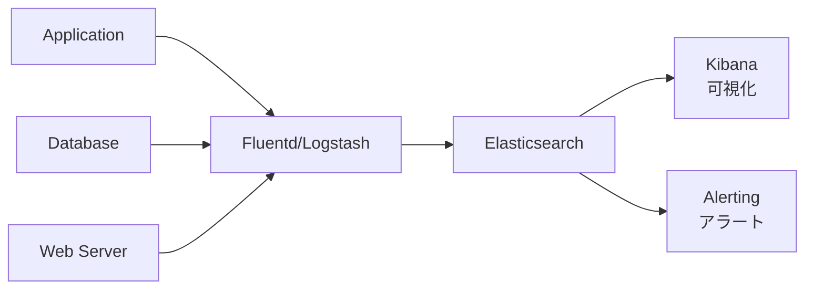

### メトリクス収集フロー

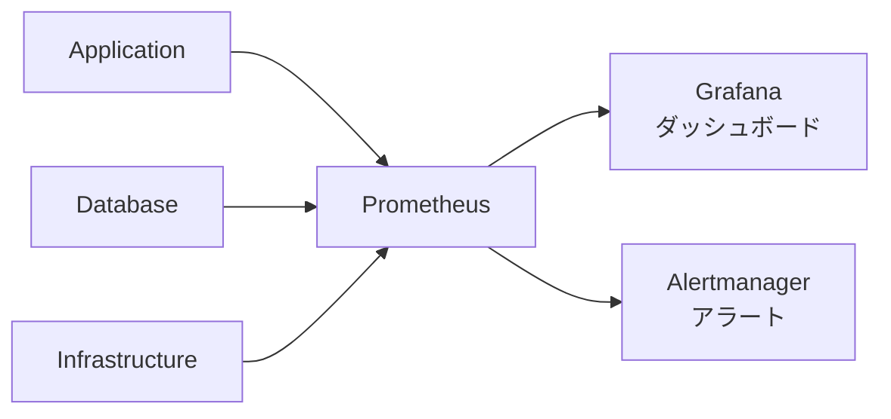

---

## パフォーマンス最適化

### N+1問題の解決

**Before (N+1クエリ)**:
```
1. 投稿一覧取得 (1クエリ)
2. 各投稿の著者情報取得 (Nクエリ)
→ 合計 N+1 クエリ
```

**After (Eager Loading)**:
```
1. 投稿一覧 + 著者情報を JOIN で取得 (1クエリ)
→ 合計 1 クエリ
```

### クエリ最適化フロー

```
[Original Query]
    ↓ Analyze
[EXPLAIN]
    ↓ Identify Bottleneck
[Index Creation / Query Rewrite]
    ↓ Test
[Performance Improvement]
```

---

## データフロー更新履歴

| 日付 | 変更内容 | 理由 | 担当者 |
|-----|---------|------|--------|
| [YYYY-MM-DD] | [変更内容] | [理由] | [担当者] |
