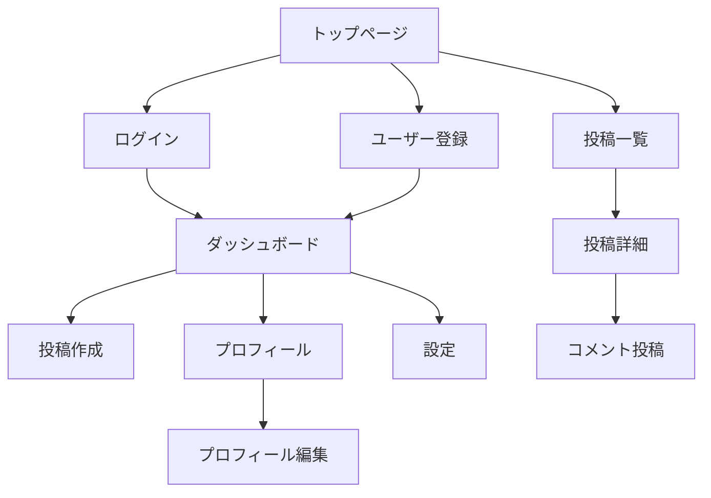

# 画面一覧

アプリケーションの全画面とその仕様を定義します。

## 概要

このドキュメントでは、アプリケーション内の各画面の目的、主要機能、遷移フローを明確にします。

---

## 画面一覧表

| 画面ID | 画面名 | URL/ルート | 認証 | 優先度 | 実装状況 |
|-------|-------|-----------|------|--------|---------|
| SCR-001 | トップページ | `/` | 不要 | 高 | 未着手 |
| SCR-002 | ログイン | `/login` | 不要 | 高 | 未着手 |
| SCR-003 | ユーザー登録 | `/register` | 不要 | 高 | 未着手 |
| SCR-004 | ダッシュボード | `/dashboard` | 必要 | 高 | 未着手 |
| SCR-005 | プロフィール | `/profile/:id` | 不要 | 中 | 未着手 |
| SCR-006 | 投稿一覧 | `/posts` | 不要 | 高 | 未着手 |
| SCR-007 | 投稿詳細 | `/posts/:id` | 不要 | 高 | 未着手 |
| SCR-008 | 投稿作成・編集 | `/posts/new`, `/posts/:id/edit` | 必要 | 高 | 未着手 |
| SCR-009 | 設定 | `/settings` | 必要 | 中 | 未着手 |

---

## 画面遷移図



---

## 画面詳細

### SCR-001: トップページ

**URL**: `/`

**説明**: アプリケーションのランディングページ

**認証**: 不要

**主要機能**:
- サービス紹介
- 最新投稿の表示（最大10件）
- CTA（Call To Action）ボタン
- ナビゲーションメニュー

**レイアウト**:
```
+----------------------------------+
|        Header (Logo, Nav)        |
+----------------------------------+
|                                  |
|        Hero Section              |
|        (Main CTA)                |
|                                  |
+----------------------------------+
|                                  |
|     Latest Posts Grid            |
|                                  |
+----------------------------------+
|           Footer                 |
+----------------------------------+
```

**表示データ**:
- 投稿タイトル
- 投稿者名
- 投稿日時
- サムネイル画像（あれば）

**アクション**:
- 「新規登録」ボタン → ユーザー登録画面へ
- 「ログイン」ボタン → ログイン画面へ
- 投稿をクリック → 投稿詳細画面へ

---

### SCR-002: ログイン

**URL**: `/login`

**説明**: ユーザー認証画面

**認証**: 不要（ログイン前）

**主要機能**:
- メールアドレス・パスワード入力
- ログイン処理
- パスワードリセットリンク
- ソーシャルログイン（オプション）

**フォーム項目**:
- メールアドレス（必須）
- パスワード（必須）
- 「ログイン状態を保持」チェックボックス

**バリデーション**:
- メールアドレス形式チェック
- パスワード未入力チェック

**エラー処理**:
- 認証失敗: 「メールアドレスまたはパスワードが正しくありません」
- アカウントロック: 「アカウントがロックされています。15分後に再試行してください」

**成功時の遷移**:
- ダッシュボード画面へ

---

### SCR-003: ユーザー登録

**URL**: `/register`

**説明**: 新規ユーザー登録画面

**認証**: 不要

**主要機能**:
- ユーザー情報入力
- 利用規約同意
- メール認証

**フォーム項目**:
- メールアドレス（必須）
- パスワード（必須）
- パスワード確認（必須）
- 表示名（必須）
- 利用規約同意チェックボックス（必須）

**バリデーション**:
- メールアドレス: 形式チェック、重複チェック
- パスワード: 8文字以上、複雑性チェック
- パスワード確認: 一致チェック
- 表示名: 1〜100文字

**エラー処理**:
- メール重複: 「このメールアドレスは既に登録されています」
- パスワード不一致: 「パスワードが一致しません」

**成功時の処理**:
1. ユーザー作成
2. 認証メール送信
3. 「メールを確認してください」メッセージ表示

---

### SCR-004: ダッシュボード

**URL**: `/dashboard`

**説明**: ログイン後のホーム画面

**認証**: 必要

**主要機能**:
- 自分の投稿一覧
- 投稿作成ボタン
- 統計情報表示
- 通知一覧

**レイアウト**:
```
+----------------------------------+
|        Header (User Menu)        |
+----------------------------------+
|  Sidebar  |    Main Content      |
|           |                      |
|  - Posts  |  Stats Cards         |
|  - Drafts |                      |
|  - Stats  |  Posts List          |
|           |                      |
+----------------------------------+
```

**表示データ**:
- 投稿総数
- 下書き数
- 総閲覧数
- コメント数
- 最近の投稿（最大20件、ページネーション）

**アクション**:
- 「新規投稿」ボタン → 投稿作成画面へ
- 投稿をクリック → 投稿編集画面へ
- フィルター切り替え（全て/公開済み/下書き）

---

### SCR-005: プロフィール

**URL**: `/profile/:id`

**説明**: ユーザーのプロフィール表示画面

**認証**: 不要（公開情報）

**主要機能**:
- プロフィール情報表示
- ユーザーの投稿一覧
- フォロー/フォロワー（オプション）

**表示データ**:
- アバター画像
- 表示名
- 自己紹介
- 投稿数
- ユーザーの投稿一覧

**アクション（自分のプロフィールの場合）**:
- 「プロフィール編集」ボタン → 設定画面へ

**アクション（他人のプロフィールの場合）**:
- 「フォロー」ボタン（オプション）

---

### SCR-006: 投稿一覧

**URL**: `/posts`

**説明**: 公開投稿の一覧表示

**認証**: 不要

**主要機能**:
- 投稿一覧表示（グリッドまたはリスト）
- 検索機能
- フィルター機能
- ソート機能
- ページネーション

**フィルター項目**:
- タグ
- 著者
- 日付範囲

**ソート項目**:
- 新着順
- 人気順（閲覧数）
- コメント数順

**表示データ（カード形式）**:
- サムネイル画像
- タイトル
- 概要（最初の150文字）
- 著者名・アバター
- 投稿日時
- タグ
- 閲覧数
- コメント数

**アクション**:
- 投稿をクリック → 投稿詳細画面へ
- タグをクリック → タグでフィルター
- 著者をクリック → プロフィール画面へ

---

### SCR-007: 投稿詳細

**URL**: `/posts/:id`

**説明**: 投稿の詳細表示とコメント

**認証**: 不要（公開投稿）

**主要機能**:
- 投稿内容表示
- コメント一覧表示
- コメント投稿（ログイン時）
- 著者情報表示

**表示データ**:
- タイトル
- 本文（Markdown or Rich Text）
- 著者情報（名前、アバター）
- 投稿日時
- 更新日時
- タグ
- 閲覧数
- コメント一覧

**アクション（投稿者の場合）**:
- 「編集」ボタン → 投稿編集画面へ
- 「削除」ボタン → 削除確認ダイアログ

**アクション（ログインユーザー）**:
- コメント投稿
- いいね（オプション）

**コメント機能**:
- ネストされたコメント表示（最大3階層）
- コメント投稿フォーム
- コメント編集・削除（自分のコメントのみ）

---

### SCR-008: 投稿作成・編集

**URL**: `/posts/new` (新規), `/posts/:id/edit` (編集)

**説明**: 投稿の作成・編集画面

**認証**: 必要

**主要機能**:
- Markdownエディター or リッチテキストエディター
- プレビュー機能
- 画像アップロード
- タグ追加
- 下書き保存
- 公開設定

**フォーム項目**:
- タイトル（必須、最大255文字）
- 本文（必須）
- タグ（最大5個）
- ステータス（下書き/公開）

**エディター機能**:
- Markdownショートカット
- 画像ドラッグ&ドロップ
- リアルタイムプレビュー
- 自動保存

**アクション**:
- 「下書き保存」ボタン
- 「公開」ボタン
- 「キャンセル」ボタン → 確認ダイアログ

**バリデーション**:
- タイトル未入力チェック
- 本文未入力チェック

---

### SCR-009: 設定

**URL**: `/settings`

**説明**: アカウント設定画面

**認証**: 必要

**主要機能**:
- プロフィール編集
- パスワード変更
- メール通知設定
- アカウント削除

**タブ構成**:
1. **プロフィール**
   - 表示名
   - 自己紹介
   - アバター画像
   - ウェブサイト

2. **アカウント**
   - メールアドレス変更
   - パスワード変更
   - 多要素認証設定

3. **通知**
   - メール通知ON/OFF
   - 通知の種類選択

4. **プライバシー**
   - プロフィール公開設定
   - アカウント削除

---

## レスポンシブデザイン

### ブレークポイント

| サイズ | ブレークポイント | 対象デバイス |
|-------|---------------|------------|
| Mobile | 〜767px | スマートフォン |
| Tablet | 768px〜1023px | タブレット |
| Desktop | 1024px〜 | PC |

### レイアウト調整

**Mobile**:
- ハンバーガーメニュー
- シングルカラムレイアウト
- タッチ操作最適化

**Tablet**:
- 2カラムレイアウト
- サイドバー折りたたみ可能

**Desktop**:
- 3カラムレイアウト（必要に応じて）
- ホバーエフェクト

---

## アクセシビリティ

### 対応項目

- [ ] キーボード操作対応
- [ ] スクリーンリーダー対応
- [ ] 適切なコントラスト比（WCAG AA）
- [ ] フォーカスインジケーター
- [ ] alt属性の設定
- [ ] ARIAラベルの使用
- [ ] セマンティックHTML

---

## パフォーマンス最適化

### 画面ロード時間目標

| 画面 | 目標 | 計測条件 |
|-----|------|---------|
| トップページ | < 2秒 | LTE接続 |
| 投稿一覧 | < 2秒 | LTE接続 |
| 投稿詳細 | < 1.5秒 | LTE接続 |
| ダッシュボード | < 2秒 | LTE接続 |

### 最適化手法

- 画像の遅延読み込み
- コード分割（Code Splitting）
- 静的アセットのキャッシュ
- CDN活用

---

## エラー画面

### 404 Not Found

- メッセージ: 「ページが見つかりません」
- ホームへ戻るボタン
- 検索ボックス（オプション）

### 500 Internal Server Error

- メッセージ: 「サーバーエラーが発生しました」
- リトライボタン
- サポート連絡先

### 403 Forbidden

- メッセージ: 「アクセス権限がありません」
- ログインボタン（未ログインの場合）

---

## 更新履歴

| 日付 | 変更内容 | 担当者 |
|-----|---------|--------|
| [YYYY-MM-DD] | [変更内容] | [担当者] |
